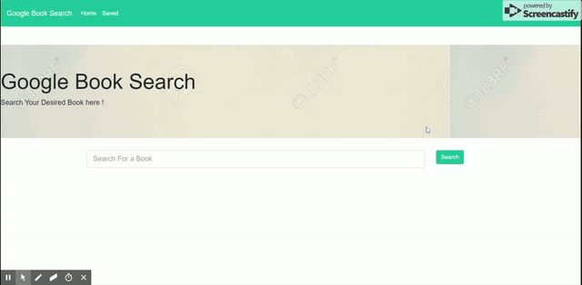

# Google Book Search

## Summary
This application allows user to search for their desired books and will provide you with all online books available. User can view the book on website and can even save those books to keep track of it in the future

## Installation Guide
* User has to download all files from GitHub repository
* User can either clone the repository or can download all files manually unzipping might take a while though
* `Package.json` file has required depencies to be installed. So, user can type `npm install` to install all needed packages
* User has to start mongo database as this application uses mongo database to store all books that are saved
* PC users can type `mongod` in separate bash terminal to kick start their mongo database
* User can create a new react application by using `create-react-app <your app name>`
* Once your react app is created, user can type `npm start` to run the application

## Technologies Used
- HTML : Basic skeleton of application basically used to append react components to DOM
- Bootstrap : For application styling
- React : Javascript library for building user interfaces
- Mongo : MongoDB is a cross-platform document oriented database program

## Application Functioning
Type `npm start` from command line. This application also requires mongo db to be run on another terminal. Functioning of application is shown below



On run of the application, enables user to go ahead and type their desired books. Then application provides you with list of books available online. User can view those books in website by clicking view button. Also, user can save those books and view saved books for future reference.

## Code Snippet

*booksController.js*

```Javascript
  create: function(req, res) {
    console.log(req.body);
    db.Book
      .create(req.body)
      .then(dbModel => {
        console.log(dbModel);
        res.json(dbModel)
      })
      .catch(err => res.status(422).json(err));
  }
```

> The above query basically post all saved books to mongo database whenever user clicks on save button on their desired books

*API GET Request*

```Javascript
router.get("/books", (req, res) => {
  console.log("My query word");
  console.log(req.query);
  axios
    .get("https://www.googleapis.com/books/v1/volumes?q=" + req.query.q)
    .then(results => {
      console.log(results.data);
      res.json(results.data)})
    .catch(err => res.status(422).json(err));
});
```
> Server side javascript to fetch details from google books apis whenever user searches for a particular book

*App.js*

```R
          <Row>
            <Col size="xs-12">
              <BookList>
                {this.state.books.map(book => (

                  <BookListItem
                    key={book.volumeInfo.title}
                    title={book.volumeInfo.title}
                    author={book.volumeInfo.authors}
                    link={book.volumeInfo.previewLink}
                    description={book.volumeInfo.description}
                    image={book.volumeInfo.imageLinks.thumbnail}
                    handleSaveButton={this.handleSaveButton}
                    id={book.id}
                  />))}

              </BookList>
            </Col>
          </Row>
```

> Above is a `react.js` code to construct list items for all books retrived from google books api. Using bootstrap, an unordered list is created populated with all values retrived from google books api.

## Learning Points
Had a lot of learning experience with M.E.R.N Stack

## Author Links
[LinkedIn](https://www.linkedin.com/in/mahisha-gunasekaran-0a780a88/)

[GitHub](https://github.com/Mahi-Mani)
### Collaborators
@Jordon [GitHub](https://github.com/hagoodj)

@Lex [GitHub](https://github.com/flexsant)